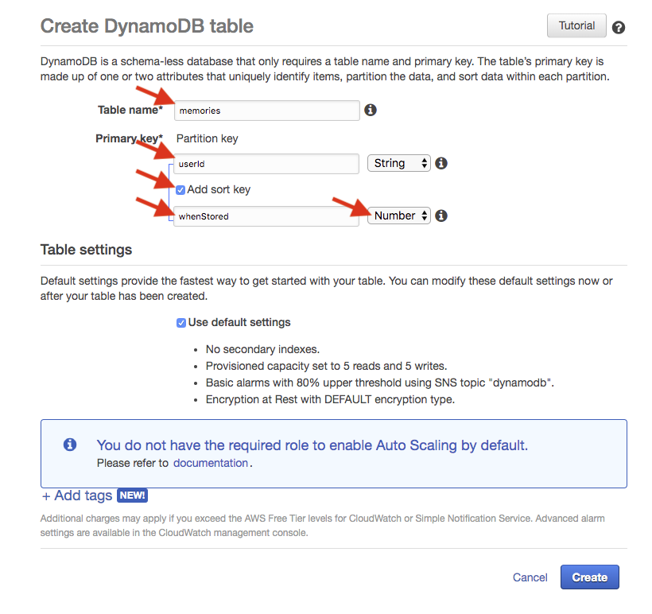

## Create your DynamoDB tables

You'll need to start by creating a table for storing memories for the example capsule. Take the following steps:
- log into the AWS Management Console and go the the [AWS DynamoDB Dashboard](https://console.aws.amazon.com/dynamodb)
- look for the `Create table` button and click on it
- you should see a Create DynamoDB table page
- you'll be entering something in each of the fields with a red arrow below (details are listed below the image)

- enter `memories` for the "Table name"
- enter `userId` for the Primary Partition key
- check the `Add sort key` checkbox (which will reveal the sort key field)
- enter `whenStored` for the sort key
- choose `Number` as the type for the sort field
- leave all other options at their default settings, and press the `Create` button
- you'll see a page that shows your table has been created

If you see an error at this point instead, one that looks like "The AWS Access Key Id needs a subscription
for the service", it may be that your AWS account is not ready yet. If you haven't received that 3rd email from AWS
yet, the one that says everything is ready, you may just need to wait.

Sometimes, at this point, you might choose to use the DynamoDB console, or write a script, to add initial data to your
table for testing purposes. The sample capsule we are creating it for here does not require that. It will add user ids
and memories to the table dynamically, as they come in.

Next: [Initialize the Lambda](04-lambda-setup.md)
