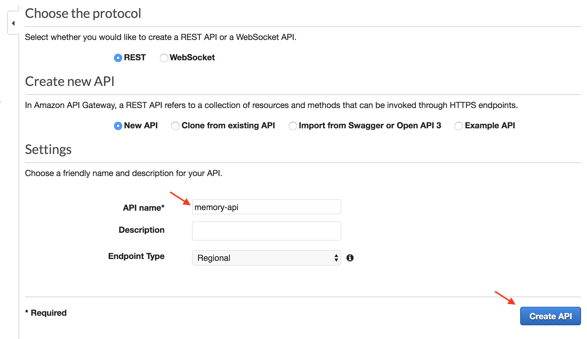
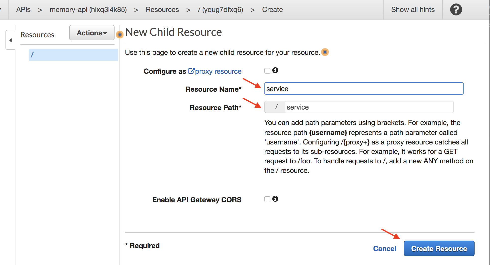
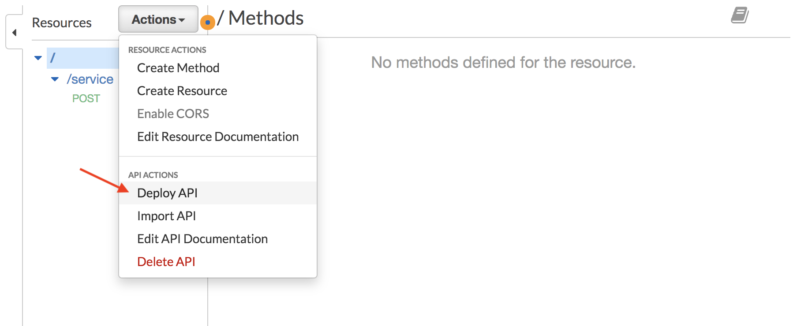
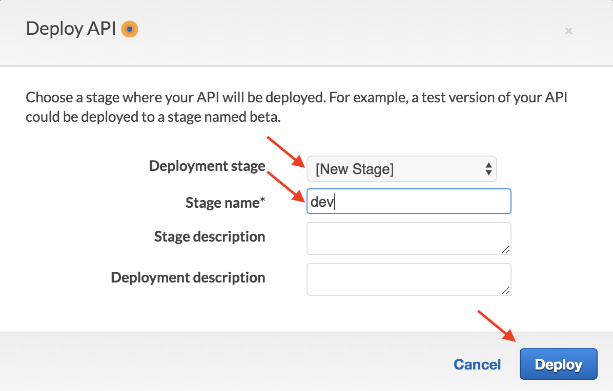
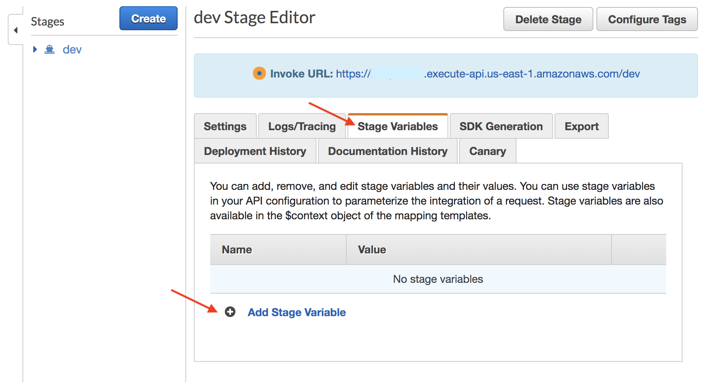
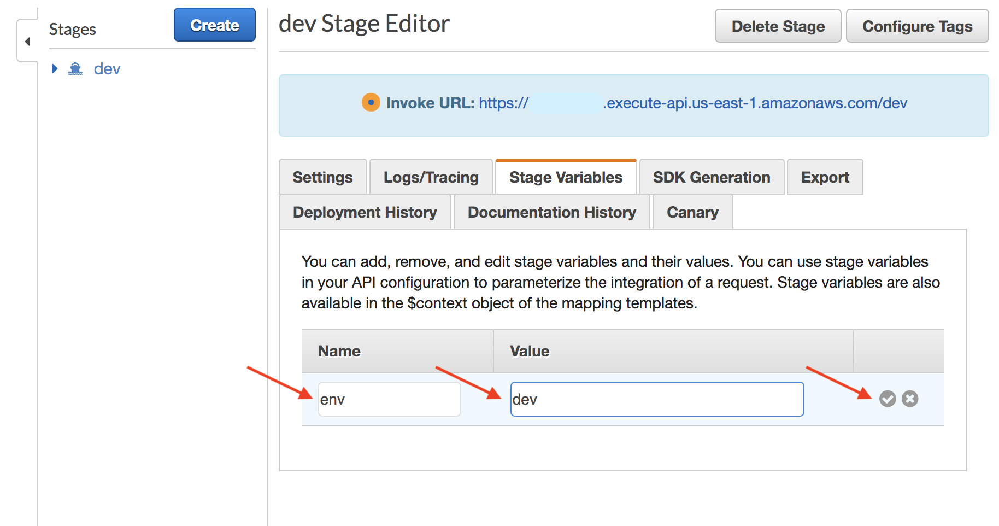
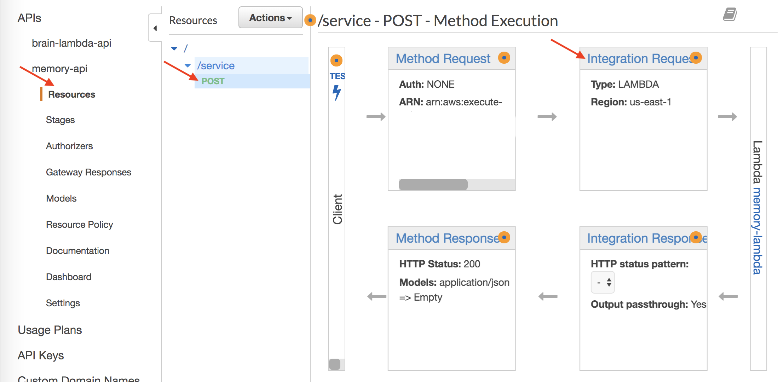
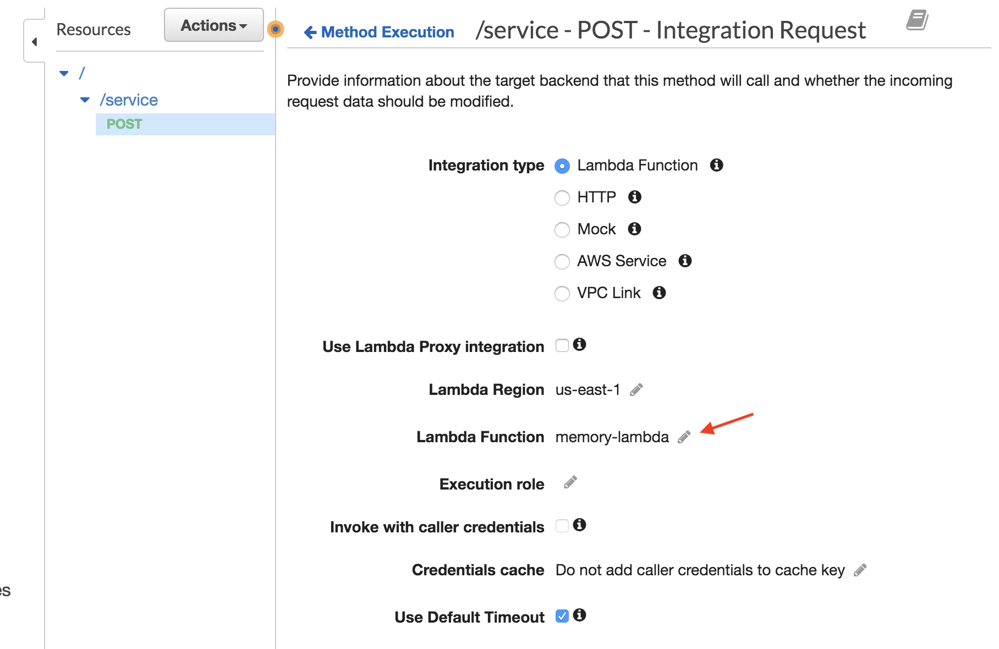
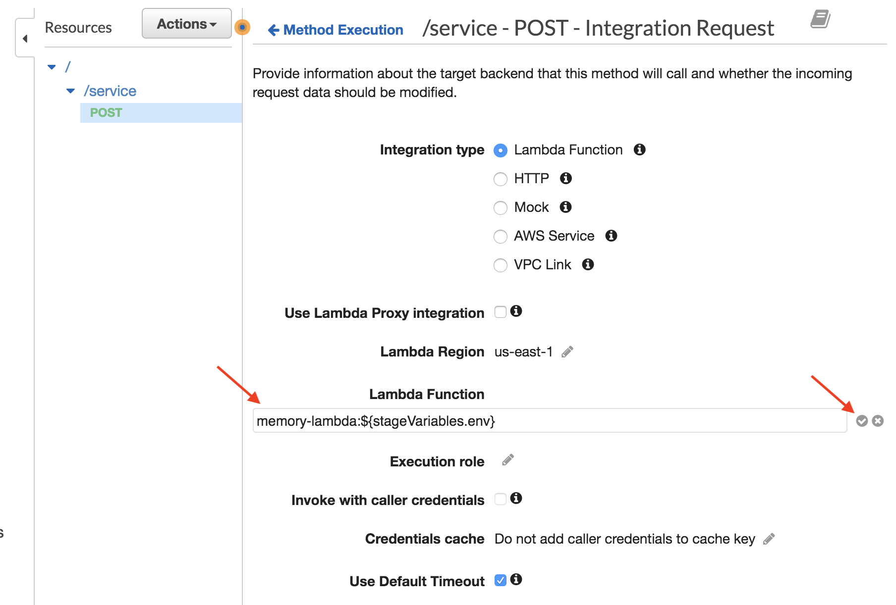
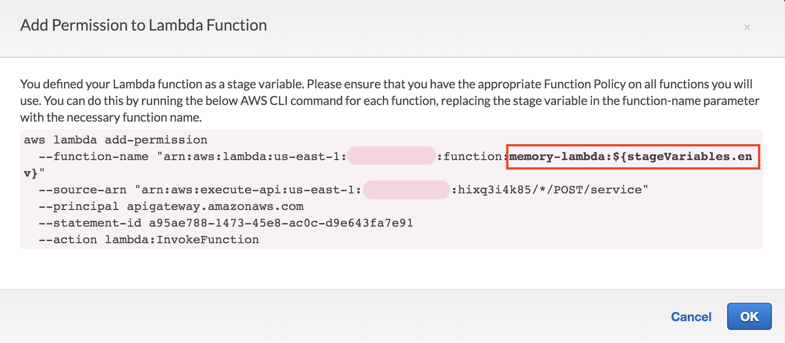

## Set up an API Gateway

You have a database now, and you've got a lambda, you'll need access to these from the outside. You'll build an
AWS API Gateway. This will expose a REST api to the outside that anyone can reach, if they know the url. In this
tutorial you'll secure it with a secret client api key, so it will only respond to you. Everyone else gets
an error if they try to use it.

Also, we're going to create 2 different "stages" for your API Gateway, one called `dev` and one called `prod`. This will
allow the API Gateway to execute a different version of your lambda function, depending on which url is used, as the
dev and prod urls will be a little different. You'll use the `dev` and `prod` aliases you set up for your lambda in
the last page of instructions.

Having two different "stages" like this means that you can assign a stable version of your lambda for use in
production, on user's devices after your capsule has been released to the marketplace. And you'll still be able to 
continue to work on bug fixes and improvements, in newer versions of your lambda and Bixby Studio using the `dev` url,
without disturbing current users.

## Creating an API Gateway Service

Here's how to create your API Gateway service:
- go the [API Gateway Service](https://console.aws.amazon.com/apigateway)
- press the blue `Create API` button
- in the page that follows, enter an API name, like `memory-api` (see image below)
- press the `Create API` button

You need to create the top-level resource for your api:
- pull down the `Actions` menu and choose `Create Resource`
- enter a resource name and resource path (use `service` for both)
- press the `Create resource` button

Now create a POST method on this resources:
- pull down the `Actions` menu and choose `Create method`
- choose POST from the menu that appears
- enter the name of the lambda function, as `memory-lambda`
- press the `Save` button
- press `Ok` when a popup window asks you about providing access to the lambda function

## Organizing the Incoming JSON Data

You'll need the API to accept JSON data, follow these steps to create a mapping:
- after the last step, you should be at the service POST page (see image below)
- click on the `Integration Request` link

- scroll down until you can see `Mapping Templates` (see image below)
- click on the triangle to expand this section
- click on the + button to add a mapping template

- enter `application/json` into the content-type field
- press the checkmark button

- when a popup comes through about changing passthrough behavior, press the `Yes, secure this integration` button

- scroll down further so you can see the generate template dropdown menu
- choose `Method Request passthru` from the menu

- once the code fills into the window, press the `Save` button 

- return to the POST method page once again by clicking on the `Method Execution` link

## Creating Dev and Prod Deployment Stages

Once your capsule is released, you are going to need separate development and production environments. That
allows you to work on new features without affecting current users. When you set up `memory-lambda`, you created
aliases for `dev` and `prod`. Now let's create two deployment stages in your AWS API Gateway, one for each.

Here's how:
- select the root level in your api navigation sidebar (if it's not already selected)
- pull down the `Actions` menu
- choose `Deploy API` (see image below)

- select `[New Stage]` for the Deployment stage (see image below) 
- enter `dev` for the State name
- press the `Deploy` button

- select the `Stage Variables` tab (see image below)
- press the `+` button next to Add Stage Variable 

- enter the variable name `env` (see image below)
- enter the value `dev`
- press the checkbox

- click on the `memory-api` -> `Resources` link in the sidebar
- repeat the process above, but use `prod` everywhere instead of `dev`

When you are done, you will have two deployment stages, `dev` and `prod`, and each wil have a stage environment
variable called `env` that has a value equal gto the stage name.

## Make the Gateway API Dynamic

Now you make the API Gateway call a different lambda alias, depending on which deployment stage is used.
Try this:
- click on the `memory-api` -> `Resources` link in the sidebar (see image below)
- expand the api service and click on the `POST` operation
- click on the `Integration Request` link 

- click on the pencil icon to edit the name of the lambda function that you entered earlier (see image below)

- modify the name of the lambda function from `memory-lambda` to `memory-lambda:${stageVariables.env}` (see image below)
- click on the checkbox

A popup window will appear, warning you that you need to give the API Gateway permission to call the lambda using both
of the new aliases. Do the following:
- copy the text from the red section into the clipboard (see image below)
- note the new lambda function call (in the red rectangle in the image below)

- open a terminal window where you have cmdline AWS access configured for this account (from the AWS setup earlier)
- paste the clipboard text onto the command line
- edit the command line, replacing `${stageVariables.env` with `dev` and press return (see image below)
- paste the clipboard text onto the command line again
- edit the command line, replacing `${stageVariables.env` with `prod` and press return

## Test your API with Postman

- download and install Postman
- create a basic REST POST query that will work
- save it and test with it

For more information about all of this, see these excellent articles:
- [Full Guide to developing REST API’s with AWS API Gateway and AWS Lambda](https://blog.sourcerer.io/full-guide-to-developing-rest-apis-with-aws-api-gateway-and-aws-lambda-d254729d6992)
- [Managing In-Production AWS Lambda Functions with API Gateway](https://medium.com/@zeebaig/managing-in-production-aws-lambda-functions-with-api-gateway-3921266ed7c6)

Next: [Create and Publish the Capsule](06-capsule-creation.md)
